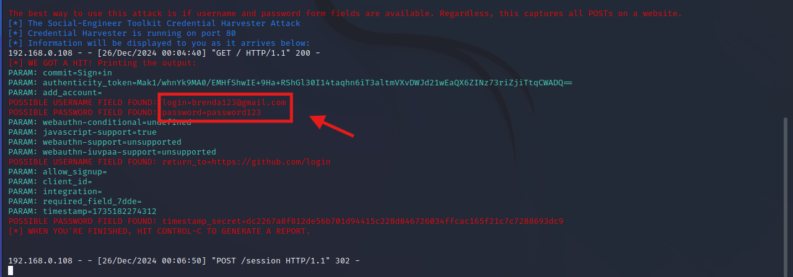

# Phishing para captura de senhas do Facebook

### Ferramentas

- Kali Linux
- setoolkit

### Configurando o Phishing no Kali Linux

- Acesso root: ``` sudo su ```
- Iniciando o setoolkit: ``` setoolkit ```
- Tipo de ataque: ``` Social-Engineering Attacks (1) ```
- Vetor de ataque: ``` Web Site Attack Vectors (2) ```
- Método de ataque: ```Credential Harvester Attack Method (3)```
- Método de ataque: ``` Site Cloner(2)```
- Obtendo o endereço da máquina: ``` ifconfig ```
- URL para clone: http://www.github.com/login

### Resultados

- Inicialmente, o trabalho foi um pouco complicado de se realizar. Toda vez que criava uma página clone do Facebook e tentava logar, ela não se redirecionava para o Facebook e portanto não enviava nada para a ferramenta. Depois de alguns ajustes e novas tentativas, consegui que redirecionasse, no entanto, apenas o username chegava na ferramenta, e a senha mostrava uma sequência aleatória de dígitos e letras. Pesquisando e explorando no Github do trabalho, vi que o Facebook têm adotado mecanismos anti-phishing. Isso justificava a razão das minhas tentativas não funcionarem, e portanto decidi fazer de outro website: o GitHub. Utilizando a página do login do GitHub, obtive esse resultado final que pode ser visto nas imagens abaixo:



